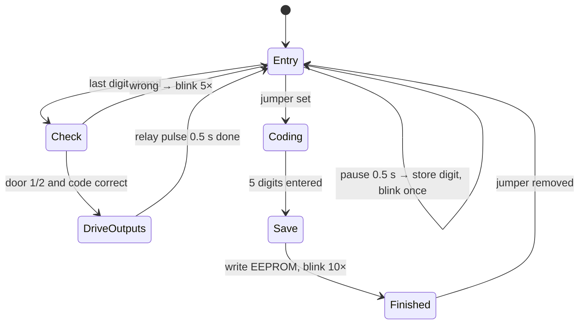

# Minimalist Garage Door Lock

[](https://doi.org/10.5281/zenodo.22988745) [](https://github.com/josto-me/minimalist-garage-door-lock/actions/workflows/build.yml) [](LICENSE) [](LICENSE-CC-BY-4.0.txt) [](CITATION.cff)

Minimalistisches Garagentor-Codeschloss: ein Taster, eine LED, eine Metallplatte.

A code lock for two garage doors, reduced to the bare minimum: **one push button, one LED
and a metal plate**. Hobby project with three firmware generations.

## Why so minimal

Keypads and touch panels at a garage door live outdoors: rain, frost, sun and dirt. They
are the parts that break first: worn-out membranes, dead touch sensors, fogged displays.
This lock uses a single vandal-proof metal push button and one LED, mounted on a plain
metal plate. There is nothing that can wear out, and no worn keys that give the code away.
The code is entered by *counting* button presses, and the LED gives the feedback.

## How it works

Every digit of the code is entered as a number of button presses. A short pause ends the digit, and a LED blink confirms it. The first digit selects the door (1 or 2), the following digits are the code. If the code is right, the relay of the selected door closes for a short pulse, wired like the door opener's own push button. A wrong code is answered with a longer blink sequence, and the lock waits for a new entry.



The diagram shows V2. V1 and V3 use the same entry principle with different timing and without the re-coding mode.

| | V1 | V2 | V3 Home_Control |
|---|---|---|---|
| MCU | Arduino Mega 2560 | ATtiny26, internal 8 MHz RC oscillator | Arduino Mega 2560 |
| Toolchain | Arduino IDE, own `main()` | avr-gcc, Makefile | Arduino IDE, own `main()` |
| Doors | 1 | 2 | 2 |
| Code | door digit + 3 digits, in `Config.h` | door digit + 4 digits, in EEPROM | door digit + 3 digits, in `Config.h` |
| Re-coding | recompile | jumper "recode" | recompile |
| Timer tick | 128 µs | 2.048 ms | 1.024 ms |
| Digit ends after | release + 0.5 s pause | 0.5 s after the last press | 1 s after the last release |
| Relay pulse | 1 s | 0.5 s | 1 s |
| Extras | press > 5 s cancels the entry; relay supply off after 30 s idle | module structure, one function per file | first module of a home control |

### V2 re-coding

1. Set jumper 1 (PA5, "recode"). The coding LED lights.
2. Enter five digits as usual. The first digit (door) is ignored, digits 2–5 become the new code.
3. The white LED blinks ten times; the code is now in EEPROM.
4. Remove the jumper.

A fresh chip (EEPROM 0 or erased 0xFF) does not open any door until a code has been set.

### Behaviour details

- V1 and V2 accept a new button state only after it has been stable for 10 ms. V3 debounces with the same 10 ms in a two-state machine.
- Press counters stop at 255 and do not wrap to 0.
- V1 and V3 access the multi-byte timer variables of the Timer0 ISR only inside `ATOMIC_BLOCK` (`Timer_Read()`/`Timer_Set()`). V2 uses 8-bit timers only.
- V2: re-coding mode starts only after a running relay pulse has finished and resets the operating state machine. Removing the jumper discards a half-entered code.
- V1 and V3 read their code from `Config.h`. The example code `{1,2,3}` must be changed before use.

## Hardware

| Part | V2 |
|---|---|
| MCU | ATtiny26-16PU, DIP-20 |
| Input | 1 code button, 3 jumpers (one used), coding button (not used by the firmware) |
| Output | 2 relay inputs (active low), BC547B switching the relay supply, white feedback LED, coding LED |
| Programming | 2×3 pin header for ISP |
| Supply | 5 V via USB cable |

Pin tables for all three versions, parts list and V2 wiring: [docs/pinout.md](docs/pinout.md).

## Security

This is a hobby project, not a security product.

- None of the versions limits the number of attempts or adds a delay after a wrong code. V2 answers a wrong code with five blinks (about 1 s) and accepts the next entry right away. A 4-digit V2 code with realistic digits 1–9 has 6561 combinations, the 3-digit V1/V3 code 729. Brute force is slow by hand but possible.
- The code is entered by counting presses, so it is easy to observe.
- The lock is only as safe as the wiring: whoever can reach the relay contacts or the controller can open the door.

Put the controller inside the garage, and only the button outside.

## Contents

```
firmware/v1/Garage_Door/     V1 sketch, version 1.5 (Arduino Mega), code in Config.h
firmware/v2/                 V2 module-based firmware (ATtiny26), code in EEPROM, Makefile
firmware/v3/Home_Control/    V3 sketch (Arduino Mega), code in Config.h
docs/pinout.md               pin tables, parts list, V2 wiring
```

## Build

**V1 and V3:** open the sketch folder in the Arduino IDE, board *Arduino Mega or Mega 2560*. Set your own code in `Config.h` first. Both sketches have their own `main()` and use Timer0 themselves, so Arduino functions such as `millis()`, `delay()` or `Serial` must not be added.

**V2:** avr-gcc and avr-libc, MCU `attiny26`, `F_CPU` 8 MHz.

```
make            # Garage_Door_V2.hex, Garage_Door_V2.eep
make fuses      # internal RC 8 MHz, EESAVE (lfuse 0xE4, hfuse 0xF3)
make flash      # program flash
make eeprom     # optional: set the stored code to "not coded"
```

`F_CPU` must match the clock of your board; all timing constants are derived from it. The internal RC oscillator frees PB4/PB5 (the XTAL pins) for I/O. Adjust `PROGRAMMER` in the `Makefile`.

## License

- Code in `firmware/`: **Apache License 2.0**, see [`LICENSE`](LICENSE) and [`NOTICE`](NOTICE).
- `docs/` and the README: **CC BY 4.0**, see [`LICENSE-CC-BY-4.0.txt`](LICENSE-CC-BY-4.0.txt).

You may use, change and share everything, also commercially. When you pass it on or
publish something based on it, credit it as:

> Johannes Stockhammer, "Minimalist Garage Door Lock", version 1.0.0, Zenodo, https://doi.org/10.5281/zenodo.22988745

GitHub shows the same citation under "Cite this repository" (from [`CITATION.cff`](CITATION.cff)).

## Dependencies

Needed to build: avr-gcc and avr-libc (modified BSD) for V2; the Arduino AVR core (LGPL-2.1-or-later) for V1 and V3.

## Trademarks

Arduino and Atmel are trademarks of their respective owners, used only to identify the hardware.

## Author

Johannes Stockhammer
